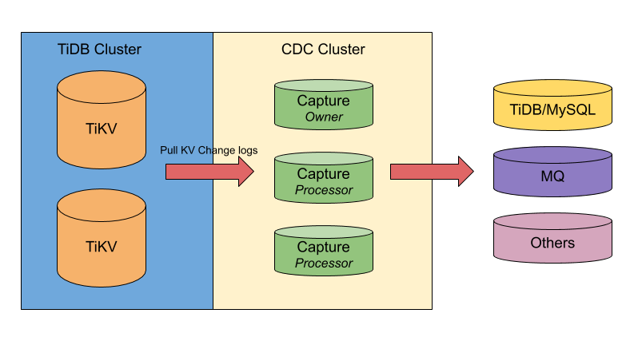

# ticdc

[](https://internal.pingcap.net/idc-jenkins/job/build_cdc_master/)

**ticdc** is a change data capture for TiDB, it supports to synchronize change data to various downstreams, including MySQL protocol compatible database, message queue via open CDC protocol and other systems such as local file storage.

## Architecture



## Documentation

TODO

## Building

To check the source code, run test cases and build binaries, you can simply run:

```bash
$ make
$ make test
```

Notice ticdc supports building with Go version `Go >= 1.13`

When ticdc is built successfully, you can find binary in the `bin` directory.

## Installing and Deployment

TODO

## Contributing
Contributions are welcomed and greatly appreciated. See [CONTRIBUTING.md](./CONTRIBUTING.md)
for details on submitting patches and the contribution workflow.

## License

TODO
