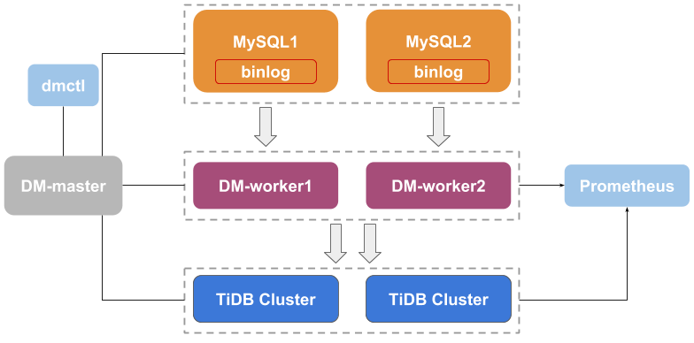

# TiDB Data Migration Platform

[**TiDB Data Migration (DM)**](https://docs.pingcap.com/tidb-data-migration/stable) is an integrated data migration task management platform that supports full data migration and incremental data replication from MySQL/MariaDB into [TiDB](https://docs.pingcap.com/tidb/stable). It helps reduce the operations cost and simplify the troubleshooting process.

## Architecture



## Documentation

- [Detailed documentation](https://docs.pingcap.com/tidb-data-migration/stable/)
- [简体中文文档](https://docs.pingcap.com/zh/tidb-data-migration/stable/)

## Building

To check the code style and build binaries, you can simply run:

```bash
make build
```

Note that DM supports building with Go version `Go >= 1.16`, and unit test preparation can be found in [Running/Unit Test](dm/tests/README.md#Unit-Test)

If you only want to build binaries, you can run:

```bash
make dm-worker  # build DM-worker

make dm-master  # build DM-master

make dmctl      # build dmctl
```

When DM is built successfully, you can find binaries in the `bin` directory.

## Run tests

Run all tests, including unit tests and integration tests:

See [Tests README](dm/tests/README.md) for a more detailed guidance.

```bash
make test
```

## Installing

See the "Deploy" section in [our doc](https://docs.pingcap.com/tidb-data-migration/)

## Config File

See the "Configuration" section in [our doc](https://docs.pingcap.com/tidb-data-migration/stable/config-overview)

## Roadmap

Read the [Roadmap](dm/roadmap.md).

## Contributing

Contributions are welcomed and greatly appreciated. See [CONTRIBUTING.md](dm/CONTRIBUTING.md)
for details on submitting patches and the contribution workflow.

Any questions? Let's discuss on [TiDB Internals forum](https://internals.tidb.io/).

## More resources

- TiDB blog

  - [English](https://pingcap.com/blog/)
  - [简体中文](https://pingcap.com/blog-cn/)

- TiDB case studies

  - [English](https://pingcap.com/case-studies/)
  - [简体中文](https://pingcap.com/cases-cn/)
