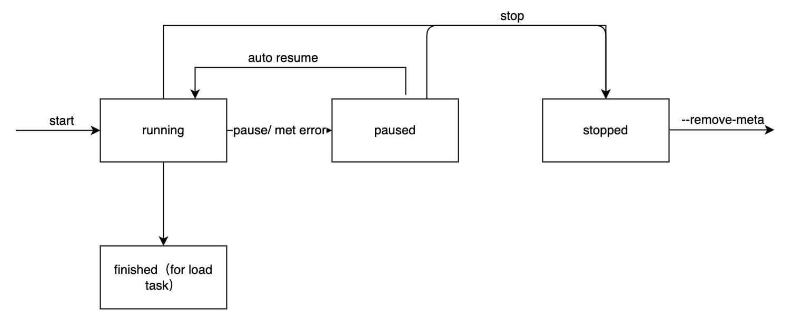

# Proposal: Enhance task manageability

- Author(s): [ehco](https://github.com/Ehco1996)
- Last updated: 2022-01-22

## Background

The main purpose of this change is to address the root cause of problems like [#3771](https://github.com/pingcap/tiflow/issues/3771), which are caused by the fact that commands about DM task do not distinguish between dynamic configuration and static resources, making it impossible for users to intuitively manage their tasks. For this reasons, we will attempt to redesign the state machine of DM task and optimize the dmctl interaction interface to provide a better user experience.

### Current State machine of task

### New State machine of task

This is mainly achieved by adding a new command `dmctl task create`, which creates a stopped task instead of creating and starting a new task with single command `dmctl start-task`.

## Goals

- Organize and optimize the state machine of tasks for better management
- Unify style of commands in dmctl and optimize dmctl interaction experience
- Add/modify OpenAPI, enhance eco-tools

## Design and Examples

New syntax of dmctl is `dmctl [resource type] [command] [flags] [arguments]`

where `resource type`, `command`, `flags` and `arguments` are:

- `resource type` specifies the resource you want to control. `resource type`s are case-insensitive and limited. Currently there are only these: `task`, `source`, `relay`, `ddl-lock` and `member`.

- `command` specifies the operation that you want to perform on one or more resources, for example `create`, `get`, `update`, `delete`, etc.

- `flags` specifies optional flags. For example, you can use the `--master-addr` flags to specify the address and port of the DM-Master server.

- `arguments` specifies the required arguments for this command, such as the name of the `task` and task config file.

### dmctl commands for Task

| Command | Full Syntax Example                                                                                                                 | Flags                                                                            | Arguments              | Description                                                       |
|---------|-------------------------------------------------------------------------------------------------------------------------------------|----------------------------------------------------------------------------------|------------------------|-------------------------------------------------------------------|
| check   | `dmctl task check --error-count=1 --warn-count=1 task1.yaml`                                                                        | --error-count(default: 10), --warn-count(default: 10)                            | config-file            | check the task config yaml file.                                  |
| create  | `dmctl task create task1.yaml`                                                                                                      |                                                                                  | config-file            | create a stopped task with config file.                           |
| update  | `dmctl task update task1 task1.yaml`                                                                                                |                                                                                  | task-name, config-file | update a stopped task with config file.                           |
| delete  | `dmctl task delete --yes --force task1`                                                                                             | --yes(default: false), --force(default: false)                                   | task-name              | delete a task and remove all meta data for this task.             |
| get     | `dmctl task get --output="new_task.yaml" task1`                                                                                     | --output                                                                         | task-name              | show the task config in yaml format, also support output to file. |
| list    | `dmctl task list --stage="Running" --source="source1,source2"`                                                                      | --source, --stage(Running/Stopped/Finished)                                      |                        | list all tasks in current cluster.                                |
| status  | `dmctl task status --source="source1,source2" task1`                                                                                | --source                                                                         | task-name              | show task detail status.                                          |
| start   | `dmctl task start --source="source1,source2" --remove-meta --start-time="2021-01-01 00:00:00" --safe-mode-time-duration="1s" task1` | --source, --remove-meta(default: false), --start-time, --safe-mode-time-duration | task-name              | start a stopped task with many flags.                             |
| stop    | `dmctl task stop --source="source1,source2" --timeout="60s" task1`                                                                  | --source, --timeout(default: "10s")                                              | task-name              | stop a running task with many flags.                              |

### dmctl commands for Source

| Command  | Full Syntax Example                                | Flags                   | Arguments                | Description                                                         |
|----------|----------------------------------------------------|-------------------------|--------------------------|---------------------------------------------------------------------|
| create   | `dmctl source create source1.yaml`                 |                         | config-file              | create source with config file.                                     |
| update   | `dmctl source update source1 source1.yaml`         |                         | source-name, config-file | update a source with config file.                                   |
| delete   | `dmctl source delete --force source1`              | --force(default: false) | source-name              | delete a source.                                                    |
| get      | `dmctl source get --output="source1.yaml" source1` | --output                | source-name              | show the source config in yaml format, also support output to file. |
| list     | `dmctl source list`                                |                         |                          | list all sources in current cluster.                                |
| status   | `dmctl source status source1`                      |                         | source-name              | show source detail status.                                          |
| enable   | `dmctl source enable source1`                      |                         | source-name              | enable a disabled source.                                           |
| disable  | `dmctl source disable source1`                     |                         | source-name              | disable a source and also stop the running subtasks of this source. |
| transfer | `dmctl source transfer source1 worker1`            |                         | source-name, worker-name | transfers a source to a free worker.                                |

### dmctl commands for Relay

| Command | Full Syntax Example                                                                                 | Flags         | Arguments              | Description                                                                  |
|---------|-----------------------------------------------------------------------------------------------------|---------------|------------------------|------------------------------------------------------------------------------|
| start   | `dmctl relay start --worker-name="worker1" source1`                                                 | --worker-name | source-name            | start relay for a source on a worker.                                        |
| stop    | `dmctl relay stop --worker-name="worker1" source1`                                                  | --worker-name | source-name            | stop relay for a source on a worker.                                         |
| purge   | `dmctl relay purge --sub-dir="2ae76434-f79f-11e8-bde2-024ac130008.000001" source1 mysql-bin.000006` | --sub-dir     | source-name, file-name | purges relay log files of the DM-worker according to the specified filename. |

### dmctl commands for DDL-LOCK

| Command | Full Syntax Example           | Flags | Arguments | Description                                  |
|---------|-------------------------------|-------|-----------|----------------------------------------------|
| list    | `dmctl ddl-lock list task1`   |       | task-name | show shard-ddl locks information for a task. |
| unlock  | `dmctl ddl-lock unlock lock1` |       | lock-id   | force unlock un-resolved DDL locks.          |

### dmctl commands for member

| Command             | Full Syntax Example                                   | Flags                                | Arguments          | Description                                       |
|---------------------|-------------------------------------------------------|--------------------------------------|--------------------|---------------------------------------------------|
| list                | `dmctl member list --name="master-1" --role="master"` | --name, --role(master/worker/leader) |                    | show members of current cluster by name and role. |
| offline             | `dmctl member offline master-1`                       |                                      | master/worker-name | offline members of current cluster by name.       |
| evict-leader        | `dmctl member evict-leader master-1`                  |                                      | master-name        | evict leader for master node.                     |
| cancel-evict-leader | `dmctl member cancel-evict-leader master-1`           |                                      | master-name        | cancel evict leader for master node.              |

### Optimized dmctl for interaction mode (optional)

The current interaction of dmctl still has room for optimization, and I hope to take this opportunity to do some optimization of the interaction experience, focusing on the user can quickly select the command they want to enter through the keyboard, instead of entering commands by their memory.

Here is a simple prototype demo:

## Breaking Changes for OpenAPI

- `POST /api/v1/tasks` will be changed from creating and starting tasks to only creating tasks.
- `DELETE /api/v1/tasks/{task-name}` will be changed from stopping task to stopping task and delete the meta data.
- `POST /api/v1/tasks/{task-name}/pause` will be updated to `POST /api/v1/tasks/{task-name}/stop`
- `POST /api/v1/tasks/{task-name}/resume` will be updated to `POST /api/v1/tasks/{task-name}/start`
- `POST /api/v1/sources/{source-name}/pause-relay` will be deleted
- `POST /api/v1/sources/{source-name}/resume-relay` will be deleted

## Milestones

### Milestone 1 - Implementation of the modified task state machine according to the design documentation

This phase is mainly about implementing the DM-Master/DM-Worker internal logic.

For tasks, the DM-Master's internal scheduling module needs to support the creation of a subtask in a stopped state, in addition to adapting additional parameters like `-start-time`,`--time-out` and so on. the DM-Worker need to watch the task stage from etcd and operate the subtask according the stage.

And for Sources, when the DM-Master receives a `disable source` request from a user, it will **synchronously** notify the DM-Worker and tell the DM-Worker to stop processing the subtask.

Note that all changes to the internal logic at this stage do not have any effect on existing dmctl.

### Milestone 2 - Defining the new OpenAPI Spec and implementing specific features

This phase is used to identify and implement the new OpenAPI and to use unit and integration tests to determine whether the OpenAPI meets expectations in certain scenarios, It is important to note that changes to the code in this phase will result in the above incompatible changes to the existing OpenAPI.

### Milestone 3 - Implementing commands in dmctl with OpenAPI and optimize the interaction experience

This phase will focus most of the effort on implementing the commands in the dmctl and optimize the interaction experience, and completing the corresponding unit and integration tests. It is to be expected that a lot of time will be spent in this phase on modifying and testing the CI.

### Milestone 4 - Perform corresponding testing and documentation completions

This is the final stage of testing, including system and compatibility testing, as well as completing the documentation.
