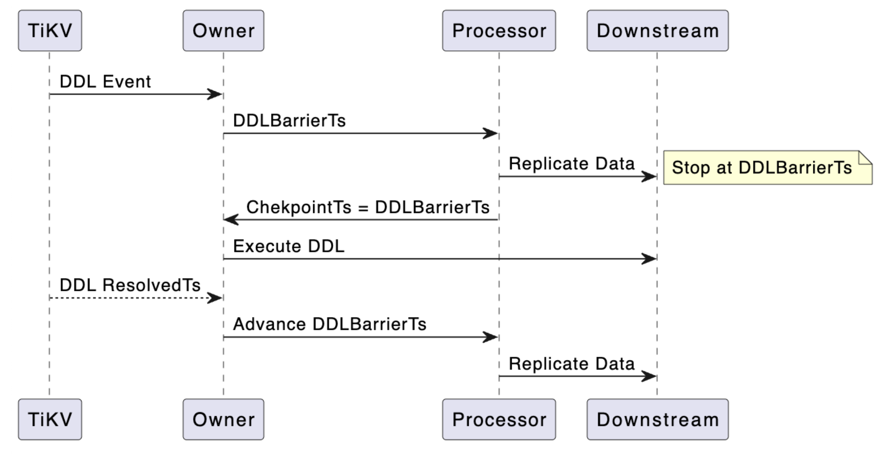
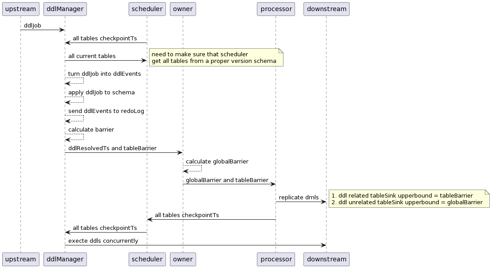

# Proposal: Make DDL only block related table

- Author(s): [asddongmen](https://github.com/asddongmen)
- Last updated: 2023-03-20

## Abstract

This proposal introduces a solution to make DDL events in TiCDC only blocks related table syncnization progress, which can effectively reducing the checkpoint lag caused by DDL synchronization.
Table of contents:

- [Background](#Background)
- [Implementation](#Implementation)

## Background

As shown in the figure above, TiCDC currently blocks the synchronization progress of all tables in all processors through the `barrierTs` mechanism before synchronizing DDL. The DDL is executed once the `checkpoinTs` have reached the `barrierTs`, after which the `barrierTs` is advanced to resume synchronization.

In this implementation, if a large number of DDL events occur in a short period of time, the checkpoint lag of the `changefeed` may increase. Especially in the scenario where a table in the `changefeed` is executing a time consuming DDL, while other tables need to synchronize a large number of row changes.

## Implementation

To reduce the impact of DDL synchronization on `changefeed` synchronizing, we hope that `changefeed` will only block the progress of related tables when executing DDL events.

To achieve DDL only blocking related tables, the key is to decouple `ddlBarrierTs` from the global `barrierTs` and narrow the scope of `ddlBarrierTs` from the `changefeed` level to the table level.

To decouple `ddlBarrierTs` and simplify the relevant logic of DDL processing in the current `changefeed` code, we need to introduce a new structure `ddlManager`. Its main functions are:

- Cache unexecuted DDL events.
- Calculate `ddlBarrierTs` and return a `map` of `tableID` -> `tableBarrierTs` to the caller.
- Maintain and update `schemaStorage` for `scheduler` to get current table information.

After introducing `ddlManager`, the interaction sequence diagram of the components involved in DDL synchronization is as follows:

First, when the DDL event sent by the upstream reaches `ddlManager`, it applies to the `schemaStorage` in memory and updates the current table information. Then, it caches the DDL in the `pendingDDLs` field, calculates the `tableBarrier` of the tables that need to execute DDL, and returns the `globalBarrierTs` of the tables that do not need to execute DDL to the `owner`.

The `owner` broadcasts the `barrier` to the `processor`, and the `processor` blocks the synchronization progress of the relevant tables based on the `barrier`. The logic of executing the DDL later is the same as the original implementation.

It is worth noting that some DDLs involve multiple tables, and some DDLs do not have corresponding tables in `changefeed` before they are executed, so it is not possible to use `tableBarrier` to block the progress of related tables. In order to limit the scope of the proposal within a certain range and avoid overly complex designs, this proposal suggests that such DDLs should be handled in the same way as the original implementation, that is, blocking the synchronization progress of the entire `changefeed`.
