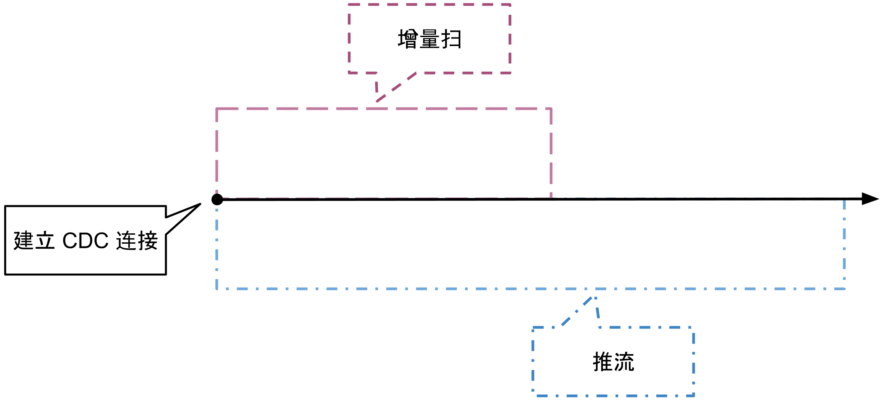
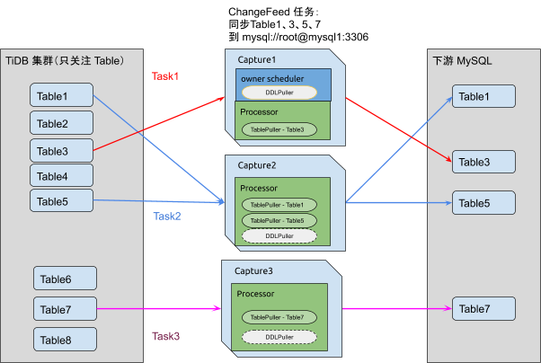

# 系统架构

TiCDC 是一款通过拉取 TiKV 变更日志实现的 TiDB 增量数据同步工具。具有还原数据到与上游任意 TSO 一致状态的能力，同时提供开放数据协议，支持其他系统订阅数据变更。

TiCDC 集群由多个无状态节点构成，通过 PD 内部的 etcd 实现高可用。集群支持创建多个同步任务，向多个不同的下游进行数据同步。TiCDC 的系统架构如下图所示：


## 系统组件

- TiKV：只输出 kv change logs
  - 内部逻辑拼装  kv change log
  - 提供输出 kv change logs 的接口，发送数据包括实时 change logs 和增量扫的 change logs

- Capture：TiCDC 运行进程，多个 capture 组成一个 TiCDC 集群，负责 kv change log 的同步
  - 每个 capture 负责一部分的 kv change logs 拉取
  - 对拉取的一个或多个 kv change log 进行排序
  - 向下游还原事务或按照 TiCDC open protocol 进行输出

## 逻辑概念

- KV change log：TiKV 提供的隐藏大部分内部实现细节的的 row changed event
- TiCDC open protocol：通过 MQ 对外提供的开放 TiCDC 协议，协议输出的 cdc log 具备以下两种处理能力
  - 按照 row 顺序更新目标系统
  - 还原等价事务逻辑同步到目标系统

- Capture：一个 TiCDC 节点独立运行时的逻辑抽象
- Owner：一种 capture 的角色，每个 TiCDC 集群同一时刻最多只存在一个 capture 具有 owner 角色，负责集群内部的调度
- Processor：capture 内部的逻辑线程，每个 processor 负责处理同一个同步流中一个或多个 table 的数据。一个 capture 节点可以运行多个 processor
- ChangeFeed：一个由用户启动的从上游 TiDB 同步到下游的任务，其中包含多个 task，task 会分布在不同的 capture 节点进行数据同步处理

# 模块设计

## TiKV 接口

### EventFeed rpc

TiKV 对 TiCDC 提供一个隐藏大部分内部实现细节的的 row changed event 的接口，该接口会扫描指定 region 的 kv range，通过 gRPC stream 持续返回 row changed event。协议的细节可以参考 [kvproto/cdcpb.proto](https://github.com/pingcap/kvproto/blob/master/proto/cdcpb.proto)。以下会分别描述建立数据流后 TiCDC 和 TiKV 的处理行为。

```
service ChangeData { rpc EventFeed(ChangeDataRequest) returns(stream ChangeDataEvent);}
```

### TiCDC 处理增量扫和实时数据流

TiCDC 使用 EventFeed 接口获取获取 ts 之后的数据的流程是：

1. 指定 ts 建立 EventFeed stream，接口返回的实时数据先在 TiCDC 内部缓存。(EventFeed stream 会返回 P + C，所以建立 stream 的时候应该要先扫下还没提交的数据，不然可能后续只拿到个 C 没有对应的 value)。
2. 在 EventFeed 接口持续获取 raftstore 的 snapshot 扫出的 ts 后的数据变更， 拿到的信息包括：(key, value, Put/Delete, ts)。（如果对应的 row kv 已经 commited，返回 commited kv record，如果没有 commited，需要返回 prewrite record），这一步就是增量扫的环节。
3. 增量扫完成时，会收到 INITIALIZED 类型的 event，TiCDC 继续处理 EventFeed 返回的实时数据。

### TiKV 具体行为

TiKV 建立 TiCDC 链接后的行为分为两个阶段：

1. 增量扫。在这个阶段，TiKV 会根据 TiCDC 请求中的 checkpoint ts 进行增量扫，输出的内容有：
   1. Prewrite，发生在 (checkpoint ts, current ts] 的上锁记录
   2. Committed，发生在 (checkpoint ts, current ts] 的提交记录，即 prewrite + commit 之后的结果
   3. Initialized，代表增量扫完成，后续不会有 committed 内容输出
2. 推流。这个阶段贯穿于整个 TiCDC 链接生命周期，将 region 上的写入实时推到下游，输出的内容有：
   1. Prewrite，region 上的上锁操作
   2. Commit，region 上的提交操作
   3. ResolvedTS，一个特殊的 TS，保证该 region 后续不会再出现小于该 TS 的提交操作

注意这两个阶段是同时开始的（即建立连接）。



### KV event

接口返回的 Event 包含 4 种类型，分别是：

- Entries：通常的 KV log event，对应的 log 类型有以下 6 种：
  - UNKNOWN：未知的 log 类型
  - PREWRITE：TiKV 在 2PC prewrite 阶段写入的数据
  - COMMITT，TiKV 在 2PC commit 阶段最后 commit 的数据
  - ROLLBACK，TiKV 在 2PC commit 阶段发生 rollback 的数据
  - COMMITED，代表增量扫过程中遇到的 commited 的内容
  - INITIALIZED，代表增量扫完成

- Admin：目前 TiCDC 中不需要处理这种类型的 event
- Error：接口出现错误是返回该类型 event，包括以下 3 种错误
  - errorpb.NotLeader
  - errorpb.RegionNotFound
  - errorpb.EpochNotMatch，region 分裂后通常会在已经建立的 gRPC stream 中返回此错误，TiCDC 遇到该错误时会重新扫描 kv range 获取新的 region 信息，并重新建立新的同步数据流。

- ResolvedTs：为了数据还原的一致性，只有当所有 region 都保证**在某个 ts 之前的所有数据都已经被 TiCDC 获取到**，TiCDC 才会对 ts 前的 kv change event 进行排序并向下游进行事务还原。 因此对于一定时间没有任何数据写入的 region，需要提供某种机制推进该 ts，以降低 TiCDC 还原事务的延迟。ResolvedTs 类型 event 就是解决这个问题。

## Capture 组件

Capture 运行过程中各组件需要持久化的数据，包括同步任务的配置，同步任务的同步状态，capture 的信息，owner 的 leader 选举信息，processor 的同步状态信息，目前都存储在 etcd 中。Capture 内部各组件的逻辑关系如图所示：



### Owner 选举策略

1. 每个 capture 节点启动时生成一个 UUID 作为 Capture ID，并向 etcd 注册 capture 信息
2. 每个 capture 会使用 [Election](https://godoc.org/github.com/coreos/etcd/clientv3/concurrency#Election) 参与 owner 选举，最多只有一个 capture 节点会选举成功成为 owner

### Owner 角色

Owner 维护全局的同步状态，会对集群的同步进行监控和适当的调度，owner 运行有以下逻辑：

- table 同步调度
  - 调度 table 的同步任务，分发到某个节点或从某个节点删除
  - 维护运行的 processor 状态信息，对于异常节点进行清理

- 执行处理 DDL，向下游同步 DDL
- 更新每一个 changefeed 的全局的 CheckpointTs 和 ResolvedTs

### Processor 角色

当 capture watch etcd 发现有新分配的 changefeed 同步任务到自己节点上时，会创建一个新的 processor 来进行数据同步 ，每个 processor 运行有以下逻辑：

- 建立 EventFeed gRPC stream 拉取 kv change event
  - processor 负责同步哪些表由 owner 调度，表的调度信息储存在 etcd 中
  - processor 创建时会读取被分配了哪些表进行同步，将这些表的 table id 按照 TiDB 内部的 key 编码逻辑进行编码得到一些需要拉取 kv change log 的 key range，processor 会综合 key range 和 region 分布信息创建多个 EventFeed gRPC stream。
  - processor 运行过程中也会监控同步信息，对于增加或删除的表调整 EventFeed gRPC stream。

- 维护本地 ResovledTs 和 CheckpointTs
- 根据全局 ResolvedTs 推进自己节点的数据向下游同步

### DML 和 DDL 的正确性保证

- 全局 ResolvedTs 由 owner 计算，取值为所有 processor 的 ResolvedTs 和 DDL puller 的 ResolvedTs 的最小值
- 所有 processor 严格按照全局 ResolvedTs 进行数据同步，只会同步数据到全局 ResolvedTs。同步数据后会更新本地 CheckpointTs
- 同步 DDL 前需要保证所有 processor 的 CheckpointTs 到达 DDL commitTs，之后才会向下游执行 DDL

# 高可用策略

目前高可用采用的策略如下所示：

- 集群内有且仅有一个 owner 角色
- owner 出现异常后可以在其他 capture 节点自动选举出新 owner
- owner 负责 table 同步的调度，采用 etcd 统一存储状态来进行调度，owner 将调度结果直接写入 etcd，processor 按照状态进行对应行为
- processor 所在节点出现异常后集群会将 table 调度到其他节点

# TiCDC open protocol

设计细节：[TiCDC Kafka 同步协议](2020-02-24-ticdc-mq-protocol-cn.md)

# 使用限制

同步到 TiDB/MySQL，需要满足以下条件才可以保证正确性

- 表必须要有主键或者唯一索引
- 如果只存在唯一索引，至少有一个唯一索引的每一列在表结构中明确定义 NOT NULL
