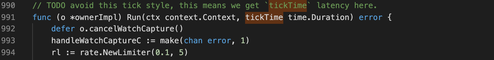
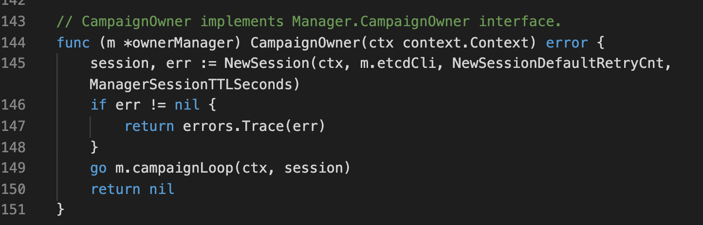
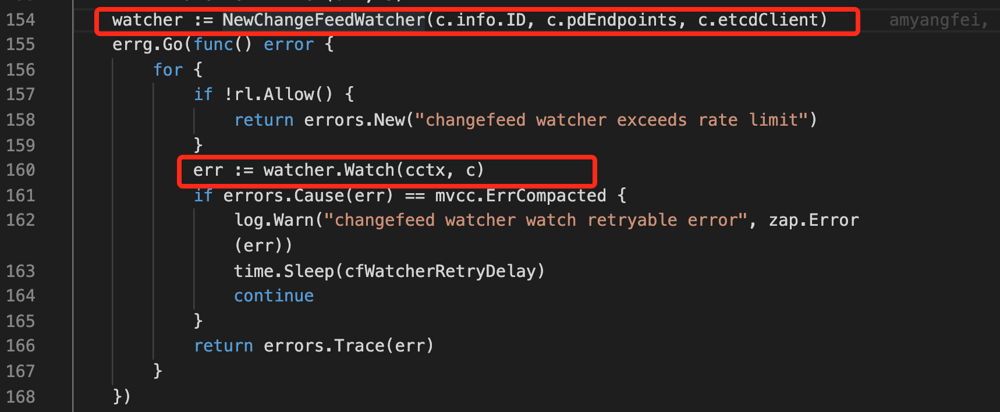
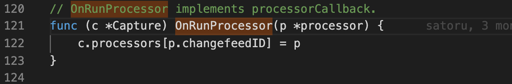

# TiCDC 高可用当前问题及改进

- Author(s): [shafreeck](https://github.com/shafreeck) (Yongquan Ren)
- Last updated: 2020-03-25

## 概述

TiCDC 高可用是指任何一个 cdc 节点挂掉，都不影响集群整体的可用性，因节点挂掉而无法处理的任务重新分派到健康节点。

不过，目前关于 HA 的实现还存在很多问题，既有机制上的不完善，也有代码封装不合理的问题。很多问题在实现时就已经注意到，因此标记为了 TODO：比如



本文总结已有代码发现的一些问题，并给出解决方案。

> 注意，本文分析代码基于 [v4.0.0-beta.2](https://github.com/pingcap/ticdc/tree/v4.0.0-beta.2) 版本

## 问题

### Capture 没有维持统一 Session

一个 Session 是指节点与 etcd 之间维持的一种保持连接的状态。Session 中含有 Lease，并在节点存活期间保持心跳。节点挂掉后，Session 失效，与其中 Lease 关联的 Key 都被删除。这常用来服务发现中对服务节点是否存活的标识。

起初，Capture 并没有使用 Session，而是仅仅在竞选 Owner 的时候创建了 Session。这样导致 Capture 挂掉后，其注册信息是无法被清理的。Capture 节点挂掉后（非正常退出），其负责的任务没有及时重新分配。这个问题在 PR [Refactor/capture watcher](https://github.com/pingcap/ticdc/pull/319) 中解决。

另外，为了减少 RTO，我们引入了 Processor 的 Session，用来及时发现挂掉的 Processor。PR：[Reduce the RTO by watching the liveness of processors](https://github.com/pingcap/ticdc/pull/312)

因此，我们目前有三个 Session，一个是 Capture Session，用来维持 Capture 存活信息，一个是 Processor Session，用来维护 Processor 存活信息，还有一个是原来存在的 Manager Session，用来竞选 Owner。

之所以新增前两个 Session 时，没有复用原来的 Manager Session，是因为现在的代码结构，复用几乎不可能。

#### Manager Session 独立于 Capture 上下文



可以看到， ownerManager 在对象内部创建 Session，这在外部的 Capture 对象中是引用不到的。

Capture 持有 ownerManager 对象，但无法持有他的 Session。


#### Processor Session 重新创建了 etcd 连接


Processor 在创建时，重新创建了对 etcd 的连接，因此注定无法复用 Capture 的 Session

#### 解决方案

由 Capture 统一维护 Session，取消 roleManager 的概念，统一在 Capture 中封装。赋予 Capture 竞选能力。在 Capture 对象内创建和管理 Processor，复用 Capture 的连接和 Session（这一点如何处理，在后面阐述另外一个问题时详细给出）。

伪代码：

```golang
func (c *Capture) Serve() {
  go c.campaign() // use the c.session inside

  for cf := WatchChangeFeeds() {
    c.processors[id] = NewProcessor(c.session, cf)
  }
}
```

### Processor 没有在 Capture 中管理

Processor 本应该是 Capture 中的执行逻辑，但其创建销毁并没有在 Capture 中管理。其主要体现在两方面。

#### Processor 在 ChangeFeedWatcher 中创建



Capture 创建了 ChangeFeedWatcher，然后在 160 行调用其 Watch 方法，并在 Watch 方法中创建 Processor。因此 Capture 便无法控制和持有 Processor 对象。

然后，Capture 实际上是 Processor 的管理者，有持有 Processor 对象的需求，因此现在使用 Callback 的方式来解决这个问题



上述 Callback 在执行一个 Processor 时调用，从而将 Processor 注册到 Capture。

之所以有这样的问题，是 Watch 接口不够合理导致，Watch 没有将监控到的事件返回，而是在内部直接做了处理，这其实违背了上下层的封装原则。也就是说， Watch 只需要返回对应的事件，由 Capture 对事件作出处理，比如启动或关闭 Processor等。

#### Processor 的存活状态由 Owner 管理

Processor 处理一个具体的同步逻辑，是 Capture 的逻辑单元，本质上是 Capture 进程内部的 goroutine，其生死存亡应该由 Capture 管理，在某个 Processor 停止或挂掉后，应该由 Capture 创建新的 Processor 来接管原来的任务，而不需要 Owner 重新分配。Owner 只应该在 Capture 挂掉后才重新分配任务到其他 Capture。这种方案形成 Owner 管理 Capture， Capture 管理 Processor 的封装层次。

但目前的实现，是由 Owner 来监控 Processor 的存活状况，在发现 Processor 挂掉后，重新新分配任务。

#### 解决方案

Owner 只管理 Capture，由 Capture 管理 Processor。ChangeFeed Watcher 只返回事件，由 Capture 来处理事件，这样之后，Processor 可以复用 Capture Session。但要做到 ChangeFeed Watcher 只返回事件还有个障碍，在下个问题中详述。

### Owner 和 Capture 的职责划分不明确

#### Capture 监控了新的 ChangeFeed 的创建

Capture 监控是否有新的 ChangeFeed 创建，如果有的话，启动一个 ProcessorWatcher 监控是否有新的任务分配过来。这里实际有两个问题，一是 ChangeFeed 应该由 Owner 管理，由 Owner 来监控其创建情况。Capture 只需要监控是否有新的任务分配过来即可。二是将 Processor 和 Task 没有划分清晰。Processor 是执行单元，Task 可以分配给 Processor 执行。因此这里的 ProcessorWatcher 叫做 TaskWatcher 更合适。

可以考虑这样解决问题：Capture 启动后，默认启动 TaskWatcher，不需要等待 ChangeFeed 的创建，比如每个 Capture 监控下列 Key 的变更情况。

```
/cdc/task/{CaptureID}/{ChangeFeedID}
```

监控前缀 /cdc/task/{CaptureID}/ ，即可监控本节点分配到的任务。

这样实现后，Capture 就可以只处理 Watch 返回的事件，启动或关闭 Processor。而不是在 Watch 逻辑中创建 Processor。

#### Capture 监控了 Capture

监控 Capture 的存活状态是 Owner 的职责，同样的，Capture 除了了解自己的 Session 是否失效外，不需要关注其他 Capture 是否存活。

#### 解决方案

由 Owner 监控 ChangeFeed 和 Capture，由 Capture 来监控 Task。区分 Processor 和 Task 的概念，在 etcd 中为其赋予不同的 Key。

### Owner 缺少明确的边界处理

在 Owner 当选时，需要做一些初始化工作，在 Owner 退位时，需要清理资源。当前的逻辑中，没有体现出这两个必要的处理阶段。而是在循环中用一个标志位决定是否是 Owner，如果是，则继续循环，跳过 Owner 的执行流程。


#### 解决方案

设计 Owner 对象，为 Owner 对象定义 Throne 和 StepDown 接口，分别处理当选 Owner 和从 Owner 退位的处理逻辑。竞选（Campaign） Owner 由 Capture 发起，竞选成功后，创建 Owner 对象，并执行 Owner 职责。

### Capture 缺少生命周期管理

Capture 在挂掉时的处理逻辑可以正常工作，但如果挂起 Capture 进程，过一段时间后继续运行，则 Capture 无法恢复。其进程虽然存在，但状态已经不可控。在这样的情况下，挂起又恢复的进程，可能由于任务已经被重新分配的关系，而产生重复的数据。另外，Capture 挂起后，Session 失效，则 Owner 认为 Capture 已经挂掉，也不会为其分配新的任务。

#### 解决方案

清晰划分 Capture 的生命周期，梳理其每个阶段应该的处理逻辑。目前 Capture 在启动和挂掉的处理逻辑已经得到很好的处理，但在挂起的情况下，处理还不够严谨。考虑为其新增 Suicide 接口，在发现自己 Session 失效后，终止所有流程并退出，这可以通过主动 panic 来实现。在 Capture 外层处理 panic，如果 panic 类型是 Suicide，则重新创建 Capture 并执行。

## 实现

上述问题的解决方案，目前还处于思路阶段，并没有经过严格的验证[[f\]](#cmnt6)。这里的实现是基于上述思路而探讨其大体实现方案，用来更清晰的描述思路，具体的实现根据实际情况可能略有调整。

### Capture 接口

- New          创建 Capture 对象，并初始化
- Serve         Capture 的核心处理流程
- Stop          优雅退出
- suicide        Session 失效后自杀（panic）
- campaign      竞选 Owner，复用 Capture 自身的 Session
- assignTask     为 Processor 分配 Task
- watchProcessor 监控 Processor 的健康状况，也可以通过封装 ProcessorWatcher 来实现
- watchTask      监控 Owner 分配的同步任务，也可以通过封装 TaskWacher 来实现

### Owner 接口

- Throne         当选 Owner 后的处理流程
- Serve          Owner 核心逻辑
- StepDown      退位后的处理流程
- watchCapture   监控 Capture
- watchJob       监控 ChangeFeed
- assignTask      分配任务给 Capture，之后由 Capture 分配给 Processor。

### ChangeFeed 定义

一个 ChangeFeed 的同步定义为一个 Job。由 Owner 分解后，赋予 Capture 的任务定义为一个 Task。Job 不等于 ChangeFeed，Task 不等于 Processor，在 etcd 的存储模型中应区分对待。

### 伪代码

#### 启动 Capture 并处理 Suicide

```golang
func main(){
  restart:
  defer func(){
    if r := recover(); r == Suicide {
      goto restart
    }
  }
  capture := New()
  capture.Serve()
  capture.Stop()
}
```

#### Capture 竞选 Owner 并启动监控新的任务

```golang
func (c *Capture) Serve() {
  go c.campaign() // 竞选 owner
  go c.watchProcessor() // 监控 processor 的删除

  tasks := c.WatchTask()
  // 监控 Owner 分派的任务，并分配给具体的 Processor 处理
  for _, task := range tasks {
    c.ssignTask(task) // 启动 processor 处理 task
  }
}
```

#### 竞选成功则启动 Owner

```golang
func (c *Capture) campaign(){
  for {
    elec := conncurrency.NewElection(c.session, prefix)
    elec.Campaign() //堵塞直到竞选成功
    owner := NewOwner()
    owner.Throne() // 可以考虑在 NewOwner 中初始化，Throne 则可以省掉
    owner.Serve()
    owner.StepDown()
  }
}
```

## 总结

经过代码的不断演进，旧的设计跟新的实现思路慢慢不匹配，为实现高可用的服务带来很多问题。本文尝试重新梳理 Capture、Owner 等核心逻辑，明确职责划分，梳理各个对象之间的关系，通过“组合”的封装思路，代替“层层调用”的封装思路，简化了 Processor，Task 等对象的管理复杂度。总的来看，本次改动大体按照以下思路进行：

- 明确对象之间的所属关系
- 划分 Capture，Owner 之间的职责范围
- 区分对象和对象的关联任务，比如 ChangeFeed 和 Job，Processor 和 Task。

### 说明

**组合**：是指将各个对象的逻辑组合起来，比如通过 Watch 返回事件，然后在外层创建 Processor，因此，Capture 将 Task 和 Processor 组合到了一起。

**层层调用**：是指对象里面逐层创建新的对象，比如 Capture 里面创建了 ChangeFeedWatcher，ChangeFeedWatcher 创建了 ProcessorWatcher （实际应该是 TaskWatcher），ProcessorWatcher 里创建了 Processor 对象。导致 Capture 较难管理 Processor 对象。
