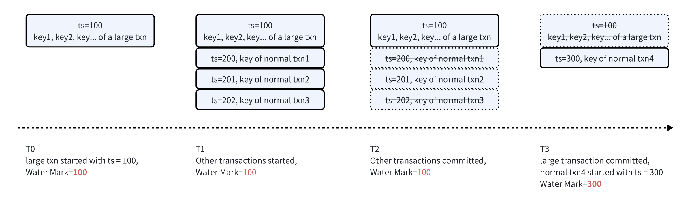

# Large Transactions Don't Block Watermark

- Author(s): [zhangjinpeng87](https://github.com/zhangjinpeng87)
- Tracking Issue(s):

## Backgroud

The Resolve TS in TiDB/TiKV essentially is a watermark, it suppose to indicate all transactions that commit in the future has a larger commit timestamp than the water mark, so all features depends on this water mark can get a determined consistency snapshot data. But in current implementation (7.6 and before versions), TiDB/TiKV uses all ongoing transactions' start-ts to calculate the Resolve TS (WM) for each region. This results in a problem that the Resolve TS will be blocked for a long time when there is a long running large transaction, because the prewrite procedure of large transactions takes a long time to finish, and the start-ts of this uncommited large transaction is relavent "old". This problem will be more severe after TiDB introduces the Pipelined DML Design , because it means TiDB relieves the limitation of large transactions, more and more customers/users will adopt the large transaction feature to simplify their application level logic.

BTW, "resolve ts" is not a good name for users and engineers to understand, and I personally would like to use "watermark" instead of resolve ts in our docs, grafana metrics and code later.

## Goals

- Watermarks of each data range can be advanced smoothly and have good freshness(at most few seconds lag), large transactions don't block the advancing of watermarks.
- Components (like CDC/PiTR/StaleRead/FlashBack/EBS Snapshot Backup) depend on old watermark (resolve ts) mechanism is compatible.
- No OOM issue for the watermark mechanism when large transactions are ongoing.
- Acceptable performance in the worst case.

## Usage of Resolve TS(Watermark) in TiDB

There are a lot of components depend on the Resolve TS(water mark) to work:

- CDC depends on the Resolve TS mechanism to advance the data replication, if the Resolve TS blocked for a long time like 10 minutes, it means changefeeds' replication will be blocked for 10 minutes. This will break the RPO of data replication.
- PiTR depends on the Resolve TS mechanism to achieve a consistency incremental snapshot across different data ranges(regions), if the Resolve TS blocked for a long time, the RPO of PiTR will be breaked.
- Stale Read depends on the Resolve TS to calculate the safe-ts, if the Resolve TS blocked, it means stale read on replicas will encounter DataIsNotReady error. One of our existing customers set staleness as 5 seconds in their production cluster (400TB cluster, avg local replica stale read 3M~5M QPS), if the Resolve TS blocked longer than 5 seconds, these 3M stale read will fallback to leader read which may cause large cross AZ traffic in this customer's case.
- FlashBack depends on the Resolve TS to flash back to a consistency spanshot state for the whole cluster or database. If the Resolve TS blocked, it is impossible to flash back to a point of time large than the Resolve TS which break the RPO of FlashBack.
- EBS snapshot Backup depends on the Resolve TS to generate a consistency data snapshot across different TiKV nodes' EBS volumes, if the Resolve TS blocked, the backup will be fail.
  From above usage of the Resolve TS, we can see the Resolve TS is a very fundamental mechanism for many components in TiDB, keep Resolve TS advancing as expected and keep it as fresh as possible is very important.
  (In the future, if we have the LogStreamService and CDC/PiTR/TiFlash built upon the LogStreamService, the watermark mechanism is a fundamental capability of LogStreamService. All these components' RPO and data freshness will be determined by how fast/fresh the watermark is.)

## How large transactions block the advancing of Water Mark?

TiKV maintains and advances the Resolve TS (water mark) for each region, it achieves this by tracking all ongoing transactions' locks and their start_ts for each region. Basically, TiKV uses the minimal start-ts of all ongoing transactions as the Resolve TS(Water Mark) for each region. This works because of the 2PC guarantee: the commit ts of transactions that haven't executed the prewrite stage must larger than all existing transaciton's start-ts, because these transactions will fetch a TS in PD after it executed the prewite stage; the commit ts of all onging transactions must larger than the minimal start-ts of all onging transactions. TiKV uses a BTree as a minimal heap to track the minimal start-ts of all ongoing transactions for each region:

```
struct Resolver {
    // A region represents a data range
    region_id: u64,

    // key -> start_ts
    locks_by_key: HashMap<Arc<[u8]>, TimeStamp>,
    // start_ts -> locked keys.
    lock_ts_heap: BTreeMap<TimeStamp, HashSet<Arc<[u8]>>>,

    ...
}
```

Because the total write data is massive in the prewrite stage for a large transaction, these prewritten key locks will stay in the `lock_ts_heap` for a long time and block the advancing of Resovle TS for related regions until the large transaction finished prewrites all data and execute the commit stage. The following diagram shows how the Resolve TS blocked by a large transaction until T3.



## Mechanism of updating primary key TTL periodically for large transaction

In TiDB's 2PC transaction protocol, TiDB prewrites all kv pairs concurrently at the prewrite stage, and then commit the primary key first and then asynchrously commit all secondary keys. If a read request encountered a prewritten but uncommitted data, it will try to check its primary key's status(committed or rollbacked, or still ongoing) to determine wait the data to be committed or rollback it. The read request uses the TTL information enveloped in the primary key to determine if this is an aborted transaction caused by crashed TiDB instances or if this is an ongoing transaction if the TTL is still alive.
For a normal transaction, the default TTL is 3s ahead of the transaction's start-ts. It means if a read request encounters a lock whose primary key's status is undetermined, the read request will check the TTL of this primary key. If the TTL is less than the read request's current ts, the read request can rollback this undetermined lock to make this read request unblocked.
In order to prevent the read request and other lock resolving mechanisms disturbing or aborting a long running large transaction, the large transaction will periodically update and advance the TTL of its primary key. The following diagram demostrate how large transaction update TTL of its primary key:


## Solution: large transactions periodically update its min-commit-ts

From "How large transactions block the advancing of Resolve TS" section we can see the root cause of large transactions block resolve ts is:

- Current Resolve TS(water mark) calculation depends on the start ts of all ongoing transactions, and the start ts of a large transaction is relevant "old" and not advanced when the large transaction is running.
  More reasonable choice is using min-commit-ts of large transactions to calculate the water mark, and same as the TTL, the large transaction periodically update its primary key's min-commit-ts information to let the water mark mechanism can advance the water mark smoothly. The following diagram demostrates the basic idea of this new proposal:


## Detailed Design

### Large Transaction Write

There are few code changes for the large transaction write part. As mentioned above, everytime the ongoing large transaction is going to update its primary key's TTL information, the transaction fetches the latest TSO from PD, and then updates the TS as min-commit-ts to the primary key.

- All locks add a "large transaction" flag.
- Large transaction periodically update primary key's min-commit-ts when updating TTL, to indicate that this large transaction is still going on and its commit ts must greater than this min-commit-ts.

```
WatermarkAdvancer (former named Resolver in TiKV)
struct WatermarkAdvancer {
    // A region represents a data range
    region_id: u64,

    // key -> start_ts, only record for normal transactions
    locks_by_key: HashMap<Arc<[u8]>, TimeStamp>,
    // start_ts -> locked keys, only record for normal transactions
    lock_start_ts_heap: BTreeMap<TimeStamp, HashSet<Arc<[u8]>>>,

    // Ongoing large transactions related info
    // start_ts -> (min-commit-ts, primary key) for ongoing large transactions
    large_txn_map: HashMap<TimeStamp, (TimeStamp, primary key)>
    // (min-commit-ts, start_ts) set, in order to distinguish different large txns with
    // the same min-commit-ts value
    large_txn_min_commit_ts_heap: BTreeSet<(TimeStamp,TimeStamp)>
}
```

We separate normal transactions and large transactions in the TS Resolver module. Because each lock contains the transaction-size (or we explicitly add large-transaction flag in the lock) information, when the Lock Observer receives a lock operation, we can dispatch the lock to related region's Resolver and according to the large transaction flag. We just store a little information like start-ts, primary-key, update-to-date min-commit-ts in the Resolver for a large transaction even though there are 1M rows changed in a region. This can significantly reduce the total memory usage of Resolver for a large transaction which can reduce the OOM issue of TiKV (we previously met some OOM issue because the Resolver occupies a lot of memory for large transactions).


### WatermarkAdvancer handles locks

When there is a new added lock for a large transaction, this must be a prewrite request,

- Write lock
  - if the start-ts of the new added lock is already in current large_txn_map we can skip it directly since we already tracked this large transaction.
  - If the start-ts of the new added lock is not in current large_txn_map , this must be the first prewrite key in this region(data range), we add it to the large_txn_map.
    When there is a new delete lock for a large transaction:
- Delete lock, this means the transaction's final status is determined, either commited or rollbacked:
  - If its start-ts is still in large_txn_map, this must be the first received committed/rollbacked key for this transaction in this data range(region), we can remove it from the large_txn_map
  - If its start-ts is not in large_txn_map, this is not the first received committed/rollbacked key for this transaction in this data ragne(region), we can ignore it since the water mark might already advanced by the first delete-lock in this data range(region)

### WatermarkAdvancer update min-commit-ts for large transactions

If the large_txn_map is not empty, it means there must be at least one large transaction is ongoing in this data range(region), we need to periodically query the min-commit-ts for these ongoing large transactions to advance the watermark of this data range.


The above diagram demonstrates a large transaction with start-ts = 100 write multiple data ranges. Each data range's WatermarkAdvancer will periodically query the min-commit-ts in its primary key for this large transaction.

#### Performance Assessment (range-level request VS store-level request)

You may have noticed that, letting each data range's WatermarkAdvancer proactively query the primary key of this large transaction may introduce a performance issue. For example, if the large transaction involves 100,000 or more data ranges, each WatermarkAdvancer queries the primary key once per second (in order to fetch fresh enough min-commit-ts), the primary key data range needs to serve 100,000 queries.
In order to decline the query QPS by many magnitude, we use store level requests instead of data range level requests. We can reuse TiKV's 'store level check leader request' to achieve this goal. There are at most N requests per second for the primary key in the above example, where N is the number of TiKV nodes, let's say 200, which represents a relatively large cluster.


## Compatibility

### CDC

CDC set a hook in TiKV's raft log applying module. CDC uses this hook to observe all data changes (key/value level prewrites(1st phase of 2PC) and commits(2nd phase of 2PC)) for specific data ranges. Meanwhile, TiKV's watermark (Resolve TS) mechanism periodically sends the latest watermark to CDC to notify downstream can consume all data that committed before this watermark.
Inside CDC, there is an uncommitted data buffer named Matcher for each data range, the matcher caches all prewrite kvs until these kvs receive corresponding commit message and then move them to Sorter one by one.
The Matcher is a kv-level map, when there is a transaction modified multiple rows, these rows will be moved from the Matcher to the Sorter one by one. Because each row will stay in the Matcher until it received its own commit message. The following diagram left part demostrates a transaction involves key0 and key1, when the Machter receive key1's commit message, it will only move key1 to the Sorter (bold part). But at that point of time, the state of this transaction is determined and the commit ts of other keys of this transaction must be 101. key0 will be moved to the Sorter after it received "key0 commit, commit-ts = 101" message.
After we use large transaction's min-commit-ts to calculate the watermark, the watermark of a data range might be advanced after it reiceived the 1st kv commit message for this transaction. This means CDC should move the whole transaction to the Sorter after CDC receives 1st kv commit message for this specific data range. The right part of following diagram demostrates this case:


CDC should use transaction level map instead of kv level map in the Matcher buffer to achieve the above goal: when the Machter receive the first commit message for a transaction in the data range, CDC can move the whole transaction in this data range from the Matcher to the Sorter.

```
// Before
type matchKey struct {
    startTs uint64
    key     string
}

type matcher struct {
    unmatchedValue map[matchKey]*cdcpb.Event_Row
    ...
}

// After
type matcher struct {
    // start-ts -> [row1, row2, row3, ...]
    unmatchedValue map[uint64][]*cdcpb.Event_Row
}
```

#### Benefits

Large transactions don't block watermarks, and the replication lag will not increase even though upstream TiDB is running some large transactions.

### Stale Read

Basically, stale read can use a stale timestamp (few seconds ago) to read data in TiKV data range(region)'s follower/learner replicas without checking any locks (skip lockcf). Data ranges'(regions') leaders send their resolve ts and corresponding applied-index (follower replicas compare their own applied-index with this applied-index to check if their local data is ready for stale read requests whose ts less than safe-ts) to follower replicas periodically. The frequency of sending this type of message is controlled by TiKV's advance-ts-interval whose default value is 20s.
Stale read requests can read determined and consistent data on the follower reaplicas is because of the safe-ts sent by leader replica. If the timestamp of stale read is larger than the safe-ts, DataIsNotReady will be returned.


After we use the min-commit-ts of a large transaction to calculate the watermark, there is a case that the WatermarkAdvancer will advance the watermark when it received some keys' commit messages but not all keys' commit messages for a large transaction. The above diagram demonstrates such a case: there is a large transaction involving key0 and key1. At the point of raflog-idx 901, the WatermarkAdvancer can advance the watermark to 106 because of the state of the large transaction which involves key0 and key1 is determined.
So, with the new watermark mechanism, Stale Read requests should read the lock cf for the above large transaction cases. If the stale read encounters locks whose start-ts less than the safe-ts, the stale read should verify if this lock is committed or rollbacked. In this case, the stale read request can check the status of this lock's primary key(must be committed or rollbacked), but this involve a remote RPC to the leader of its primary key. When the WatermarkAdvancer (on the leader replica) publishes the safe-ts(wm) messages to follower replicas, it also can publish its large transaction's min-commit-ts or commit-ts to elimiate above remote RPC queries.

#### Benefits

Stale Read will not be blocked by large transactions with the new watermark mechanism.

### PiTR

PiTR is a bit similar to CDC. The PiTR module upload raftlogs to cloud storage for each data range(region) periodically. Meanwhile, PiTR will update each data range's corresponding "resolve ts". The minimal "resolve ts" data range of a table determines the RPO of the PiTR feature for this table. After we use the new watermark mechanism, from above analysis we can see all transactions whose commit ts is less than the watermark are determined and consistent, so there is no side effects for the PiTR module. Instead, the new watermark mechanism can let the PiTR gain better RPO when there are large transactions ongoing.

### FlashBack Cluster

Similar with PiTR and CDC, FlashBack Cluster uses the "resolve ts" mechanism to fallback the current TiDB cluster to a consistency and determined snapshot status, and the FlashBack ts must be less than the resolve-ts . With the new watermark mechanism, the FlashBack Cluster feature can achieve the same goal without any changes. Furthermore, FlashBack Cluster can achieve better RPO if there are large transactions ongoing.

### EBS Snapshot Backup

### Rolling Upgrade

#### Rolling upgrade TiKV

There should be version control to adopt the new watermark mechanism. TiKV should use old resolve-ts mechanism while the TiKV cluster is rolling upgrade. After all TiKV nodes are upgraded, the new watermark mechanism will take effect.

#### Rolling upgrade TiCDC

TiCDC should be upgraded before TiKV (which is default behavior right now), and TiCDC can move the whole transaction from the Matcher buffer to the Sorter as soon as TiCDC receives the first commit/rollback message for a transaction. This new behaviour is compatible with old "resolve-ts" mechanism as well as new watermark mechanism.

## Alternatives we have considered

There was a proposal that calculate the ResolvedTs and CommittedTs in TiDB layer, this proposal has following drawbacks:

- Change distributed water mark calculation into PD centralized calculation. If there are 1 million tables, calculating table-level water marks is nearly impossible
- The TiKV layer is the source of truth, and it always has the latest information to advance the water mark. If we move the water mark calculation to the TiDB layer, we may sacrifice some freshness of the water mark.
