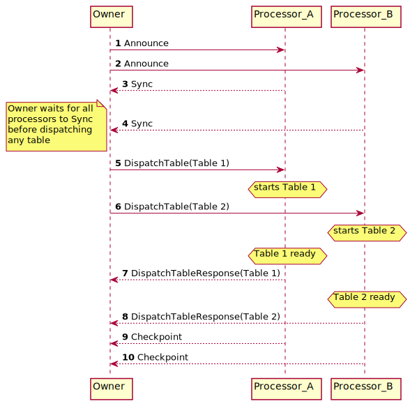
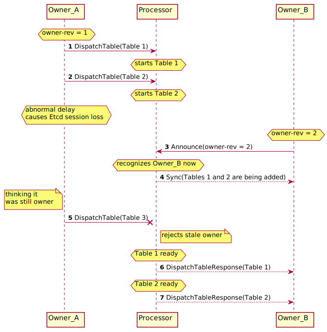

# Distributed Scheduling in TiCDC

## Background

TiCDC boasts high availability and horizontal scalability. To make this possible, TiCDC needs a distributed scheduling mechanism, a mechanism by which tables can be distributed across the nodes in the cluster and sustain failures of nodes. We still need a center of control, which we call the Owner, but the Owner should fail over very quickly if a node running the Owner has crashed.

In the beginning of the TiCDC project, we chose a solution that sends all information over Etcd, which is a distributed key-value store. However, this solution has proven to be problematic as it fails to scale both horizontally and vertically. As a result, we created a solution using direct peer-to-peer messaging, which not only has semantics better suited to scheduling, but also performs and scales better.

## The Abstraction

To succinctly describe the algorithm used here, we need to abstract the TiCDC Owner and Processor. To simplify the matter, we will omit "changefeed" management here, and suppose that multiple "changefeeds" are isolated from each other as far as scheduling is concerned.

- The Owner is a piece of code that can persist and restore a timestamp `global checkpoint`, which is guaranteed to be monotonically increasing and is a lower bound of the progresses of all nodes on all tables. The Owner will call our `ScheduleDispatcher` periodically and supply it with both the latest `global checkpoint` and a list of tables that should currently be replicating.
- The Processor is a piece of code that actually replicates the tables. We can `Add` and `Remove` tables from it, and query about the status of a table.

## The Protocol

The communication protocol between the Owner and the Processors is as follows:

### Message Types

#### DispatchTable

- Direction: Owner -> Processor

- Semantics: Informs the processor to start (or stop) replicating a table.

- ```go
  type DispatchTableMessage struct {
  	OwnerRev int64   `json:"owner-rev"`
  	ID       TableID `json:"id"`
  	IsDelete bool    `json:"is-delete"`
  }
  ```

#### DispatchTableResponse

- Direction: Processor -> Owner

- Semantics: Informs the owner that the processor has finished a table operation on the given table.

- ```go
  type DispatchTableResponseMessage struct {
  	ID TableID `json:"id"`
  }
  ```

#### Announce

- Direction: Owner -> Processor

- Semantics: Announces the election of the sender node as the owner.

- ```go
  type AnnounceMessage struct {
  	OwnerRev int64 `json:"owner-rev"`
  	// Sends the owner's version for compatibility check
  	OwnerVersion string `json:"owner-version"`
  }
  ```

#### Sync

- Direction: Processor -> Owner

- Semantics: Tells the newly elected owner the processor's state, or tells the owner that the processor has restarted.

- ```go
  type SyncMessage struct {
  	// Sends the processor's version for compatibility check
  	ProcessorVersion string

  	Running          []TableID
  	Adding           []TableID
  	Removing         []TableID
  }
  ```

#### Checkpoint

- Direction: Processor -> Owner

- Semantics: The processor reports to the owner its current watermarks.

- ```go
  type CheckpointMessage struct {
  	CheckpointTs Ts `json:"checkpoint-ts"`
  	ResolvedTs   Ts `json:"resolved-ts"`
      // We can add more fields in the future
  }
  ```

### Interaction



The figure above shows the basic flow of interaction between the Owner and the Processors.

1. **Owner** gets elected and announces its ownership to **Processor A**.
2. Similarly, **Owner** announces its ownership to **Processor B**.
3. **Processor A** reports to **Owner** its internal state, which includes which tables are being added, removed and run.
4. **Processor B** does the same.
5. **Owner** tells **Processor A** to start replicating _Table 1_.
6. **Owner** tells **Processor B** to start replicating _Table 2_.
7. **Processor A** reports that _Table 1_ has finished initializing and is now being replicated.
8. **Processor B** reports that _Table 2_ has finished initializing and is now being replicated.
9. **Processor A** sends its watermark.
10. **Processor B** sends its watermark too.

### Owner Switches

Because of TiCDC's high availability, the communication protocol needs to handle owner switches. The basic idea here is that, when a new owner takes over, it queries all alive processors' states and prepares to react to the processors' messages (especially `DispatchTableResponse` and `Checkpoint`) exactly as the previous owner would.

Moreover, if the old owner is ignorant of the fact that it is no longer the owner and still tries to act as the owner, the processors would reject the old owner's commands once it receives at least one message from the new owner. The order of owners' succession is recorded by the `owner-rev` field in `Announce` and `DispatchTable`.



## Correctness Discussion

### Assumptions

Here are some basic assumptions needed before we discuss correctness.

- Etcd is correctly implemented, i.e. it does not violate its own safety promises. For example, we should not have two owners elected at the same time, and two successive owners should hold `owner-rev` with one larger than the other.
- The Processors can stop writing to the downstream immediately after it loses its Etcd session. This is a very strong assumption and is not realistic. But if we accept the possibility of a processor writing to the downstream infinitely into the future even after it loses connection to Etcd, no protocol would be correct for our purpose.

One part of correctness is _safety_, and it mainly consists of two parts:

1. Two processors do not write to the same downstream table at the same time (No Double Write)
2. The owner does not push `checkpoint-ts` unless all tables are being replicated and all of them meet the `checkpoint`(No Lost Table).

In addition to safety, _liveness_ is also in a broad sense part of correctness. Our liveness guarantee is simple:

- If the cluster is stable, i.e., no node crashes and no network isolation happens, replication will _eventually_ make progress.

In other words, the liveness guarantee says that _the cluster does not deadlock itself, and when everything is running and network is working, the cluster eventually works as a whole_.

We will be focusing on _safety_ here because it is more difficult to detect.

### Owner switches

- For _No Double Write_ to be violated, the new owner must not assign a table again when the table is still running. But since the new owner will only assign tables when the captures registered to Etcd at some point (_T0_) have all sent _Sync_ to the new owner, the owner cannot reassign a table already running on any of these captures. To see the impossibility, we know the only possibility for _No Double Write_ to be violated is for a processor to be running at some point _T1_ after _T0_, but this would imply that the capture has gone online after the new owner is elected, and since the new owner cannot reassign a table, it must have been an old owner who has assigned the table. But since _EtcdWorker_ does not allow the old owner to receive new capture information after the new owner gets elected, it is an impossibility.
- _No Lost Table_ is guaranteed because the owner will advance the watermarks only if all captures have sent _Sync_ and sent their respective watermarks.

### Processor restarts

Definition: a processor is called to have restarted if its internal state has been cleared but its capture ID has **not** changed.

- First assume that the system is correct before the restart. Then since the restart only makes certain tables' replication stop, it will not create any _Double Write_. Then the restarted processor will send _Sync_ to the owner, which tells the owner that it is no longer replicating any table, and then the owner will re-dispatch the lost tables. So _No Double Write_ is not violated.
- _No Lost Table_ is not violated either, because a restarted processor does not replicate any table, which means that it will not upload any _checkpoint_. In other words, the global checkpoint will not be advanced during the restart of the processor.
