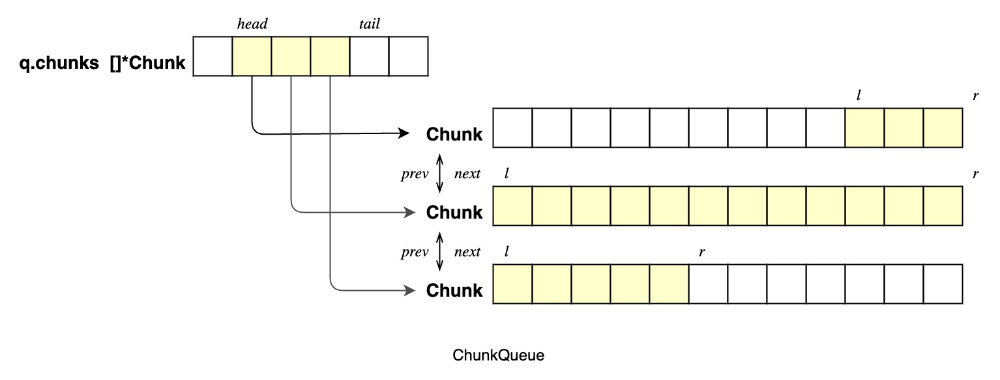

# Containers for TiFlow

## ChunkQueue

An memory efficient queue implementation in Golang.

### Features

- Support for Generics (Go 1.18+)
- Chunked memory allocation. Compared to slice, it's GC-friendly and free of 
redundant copy when pushing and popping
- Support iterator operations and multiple range methods

### Design
The design of ChunkQueue is as follows.
ChunkQueue divides the memory allocation into equal-length segments. A segment
is called a chunk. ChunkQueue maintains an array []*chunks, addresses of chunks
in use.

The length of each chunk, `chunkLength`, is determined during the queue's initialization.
For example, the chunk length of a ChunkQueue[T] is `max{16, 1Kb / size of type T}`.
For each chunk, interval [l, r) are valid elements.

Push() puts an element at the free index of the last chunk. A new chunk will be
added if the last chunk is complete. Pop() pops an element from the first non-empty
index of the first chunk. The whole chunk will be poped if it becomes empty.

PushMany() and PopMany(int) operates multiple elements at a time, optimized by
copy(). The second return value of PopMany(n int) indicates whether the number
of elements popped meets the input n.

For a ChunkQueue, there is at most one non-full chunk at both ends.




### APIs
#### ChunkQueue[T]

Basic APIs
```Go
Empty() bool
Len()   int
Head()  (T, bool)   // read-only value of the head, bool is false for empty queue
Tail()  (T, bool)   // read-only value of the tail, bool is false for empty queue
Peek(index int) T   // read-only value of a given index
Replace(index int, val T)   // replace the value of a given index with val

Push(val T)         // Enqueue;
Pop() (T, bool)     // Dequeue Op; The bool is false for a empty queue

PushMany(vals ...T)
PopMany(n int) ([]T, bool)  // If Len() < n, the bool is false and all elements will be poped
PopAll()    []T

Shrink()    // Shrink shrinks the space of the chunks array
Clear()     // Clear clears the queue and shrinks the chunks array
```
Iterator related APIs
```Go
GetIterator(index int)  *ChunkQueueIterator[T]  // nil for index not in [0, Len())

First() *ChunkQueueIterator[T]  
Last()  *ChunkQueueIterator[T]

Begin() *ChunkQueueIterator[T]  // an alias of First(), interchangeable with First()
End()   *ChunkQueueIterator[T]  // an invalid iterator representing the end
```

GetIterator returns an iterator of a given index. Nil for invalid indices.

First() and Last() returns the iterator of the first and last elements, 
respectively. The validity of them depends on whether the queue is empty.

End() is a special invalid iterator of the queue representing the end, whose
predecessor is Last()

#### ChunkQueueIterator[T]
```Go
Valid()     // true if the element of the iterator is in queue
Index() int // index of the iterator staring from 0; -1 for invalid ones

Value() T   // Value is read-only
Set(v T)

Next() bool
Prev() bool
```

Next() and Prev() update the current iterator to its next and previous iterator,
respectively. The return value is boolean, which also indicates the validity of
the updated iterator.

For an end iterator, Prev() will update it to Last() and return true. For other
invalid iterators, Prev() and Next() are no-ops and always return false.

Using invalid iterators may panic.

### Range and Iteration

Range methods are counterparts of the range of slice. They scan the queue
from the head to tail.

```Go
// Range iterates the queue from head to the first element e that f(e) returns
// false, or to the end if f() is true for all elements.
Range(f func(e T) bool)

// RangeWithIndex iterates the queue with index from head to the first element
// e that f(index, e) is false, or to the end if f() is true for all elements.
RangeWithIndex(f func(idx int, e T) bool)

// RangeAndPop iterates and pops elements from head to the first element e that
// f(e) is false, or all elements if f(e) is true for all elements.
// This method is more convenient than Peek and Pop
RangeAndPop(f func(e T) bool)
```

### Examples 

```Go
q := NewChunkQueue[int]()

q.Push(1)                   // 1
q.PushMany(2, 3, 4)         // 1, 2, 3, 4

l := q.Len()                // l = 4

val, ok := q.Pop()          // 1, true
vals, ok := q.PopMany(2)    // [2, 3], true
vals, ok := q.PopMany(2)    // [4], false

s := []int{5, 6, 7, 8, 9, 10}
q.PushMany(s...)            // 5, 6, 7, 8, 9, 10
vals, ok = q.PopAll()       // [5, 6, 7, 8, 9, 10], true

q.Range(func(v int) bool {
	if v < 10 {
		return false
	}
	// ...
	return true
})

cnt := 0
q.RangeAndPop(func (v int) bool {
	if v > 7 {
		return false
	}
	cnt += v    // cnt = 5 + 6 + 7 
	// return true
})

```
Manipulating invalid iterators may incur panic. Please be careful and do checks
since a valid iterator can become invalid after the element was popped out. 

Specifically, if the iterator is the head element while iterating, can only 
Pop() after the Next() operation.

```Go
for it := q.First(); it.Valid(); it.Next() { // forward iteration
	// ... ops cannot pop
}

for it := q.First(); it.Valid(); {
	// ...
	it.Next()
	q.Pop() // can only Pop() after Next()
}

for it := q.Last(); it.Valid(); it.Next() { 
	// ...
}
```

The return value of Next() and Prev() are booleans which also indicate the
validity. So, the backward iteration can also be written as follows:
```Go
for it := q.End(); it.Prev(); {
	// ...
}
```

### Benchmark
ChunkQueue uses less time and less memory per operation.

```log
BenchmarkPush/Push-ChunkQueue-8                 269918079       4.359 ns/op         8 B/op
BenchmarkPush/Push-Slice-8                      356492558       9.950 ns/op         42 B/op
BenchmarkPush/Push-3rdPartyDeque-8              58088172        19.78 ns/op         24 B/op

BenchmarkPushMany
BenchmarkPushMany/PushMany-ChunkDeque-8         82057828        24.89 ns/op         78 B/op
BenchmarkPushMany/PushMany-ChunkDeque-1By1-8    30489063        36.43 ns/op         78 B/op
BenchmarkPushMany/PushMany-Slice-8              100000000       95.58 ns/op         271 B/op
BenchmarkPushMany/PushMany-3rdPartyDeque-8      8411283         125.9 ns/op         218 B/op

BenchmarkPopMany
BenchmarkPopMany/PopMany-ChunkDeque-8           843638862       6.266 ns/op
BenchmarkPopMany/PopMany-Slice-8                332659428       4.096 ns/op
BenchmarkPopMany/PopMany-3rdPartyDeque-8        193823920       13.74 ns/op

BenchmarkLoopPop
BenchmarkChunkQueueLoopPop/ChunkQueue-RangeAndPop-8         448408568           2.649 ns/op
BenchmarkChunkQueueLoopPop/ChunkQueue-IterateAndPop-8       326951571           3.751 ns/op
BenchmarkChunkQueueLoopPop/ChunkQueue-PeekAndPop-8          291695371           4.160 ns/op

BenchmarkIterate
BenchmarkIterate/Iterate-ChunkQueue-by-iterator-8           538929010           2.227 ns/op
BenchmarkIterate/Iterate-ChunkQueue-by-Peek-8               479762835           2.582 ns/op
BenchmarkIterate/Iterate-ChunkQueue-by-Range-8              554261636           2.162 ns/op
BenchmarkIterate/Iterate-Slice-byLoop-8                     1000000000          2.221 ns/op
BenchmarkIterate/Iterate-3rdPartyDeque-byRange-8            472465203           10.94 ns/op
BenchmarkIterate/Iterate-3rdPartyDeque-byPeek-8             1000000             6213 ns/op
```
